# Region4 - Innovation Lab Malmö

## Introduction and Objectives of the Climate Risk Assessment

Malmö is a coastal city in southern Sweden, and the third-largest urban area. It is also an important harbour city. In recent years more frequent and intense heatwaves have posed new challenges. Urban heat stress has emerged as a climate risk, with densely built or paved zones experiencing significantly higher temperatures than greener areas, increasing heat-related health risks in the city.

The Malmö CRA baseline focuses on Nyhamnen, and the former ferry terminal area is an extensively paved district, highly exposed to heat stress and in the scope for redevelopment. The area sits in an industrial harbour environment dominated by large, paved surfaces (roads, parking areas, port infrastructure) and a few low-rise buildings, with very limited green space. As a result, it is prone to extreme surface heating on sunny days which makes it a growing health issue as the climate change makes it hotter in the summer.

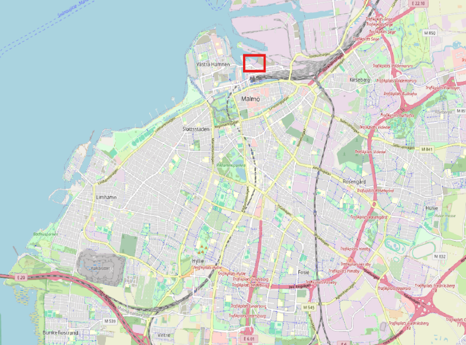

_Figure 1 - Map of Malmö, Ferry terminal in the red rectangle._

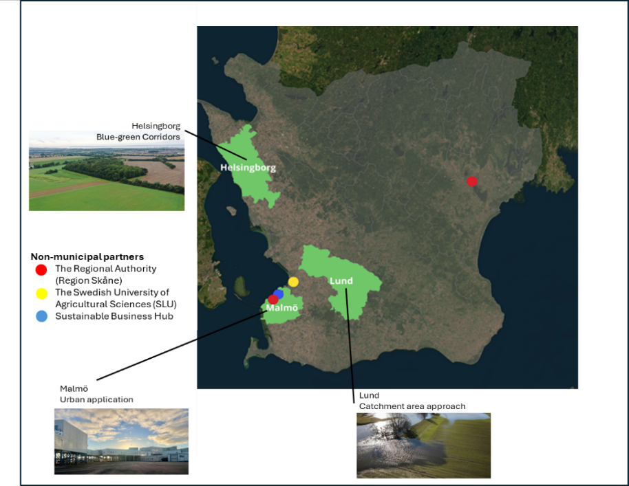

_Figure 2 - Location of the labs in skåne, Sweden._

Co-Innovation Lab 1 builds on Malmö’s long-term commitment to using Nature-based Solutions (NbS) in urban development, particularly to reduce heat stress and strengthen climate resilience. The planning has been developed over several years, including preparatory work through the Blue Green City Lab project. This work helped identify Nyhamnen and the ferry terminal as a strategic location, engage key stakeholders, and shape a concept for testing an “urban forest” pilot at the Ferry Terminal as part of the Nyhamnen redevelopment.

An urban forest has been planted at the Ferry Terminal in September 2025 as a Nature based Solution to mitigate heat stress and improve microclimatic conditions at the site and the analysis compares conditions before and after its implementation. This CRA establishes a baseline for urban heat exposure in the Ferry Terminal area by comparing a fully paved before NbS apron scenario with the current situation see Figure 3.

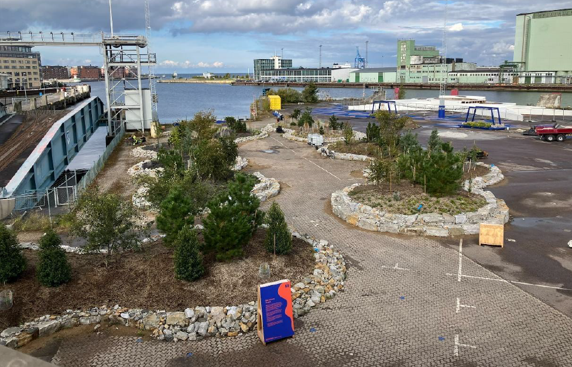 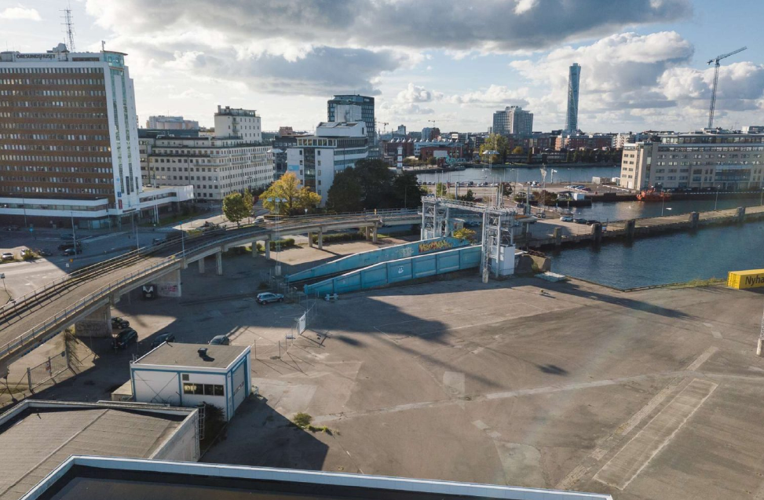

_Figure 3 - Ferry terminal, Co-Innovation Lab 1 in Malmö Figure 4 - Ferry terminal, Co-Innovation Lab 1 in Malmö_

_before the plantation of the urban forest. Photo: Olle Enqvist. with the urban forest. Photo: Olle Enqvist._

* **Disclaimer**

> This version of the tutorial demonstrates the application of a CRA workflow for urban heat risk based on land-cover and morphological indicators, producing a static heat exposure map. Full air-temperature simulations using the specific tool modules are currently under test and will be integrated in future updates of the workflow. The following indicator table reflects current simplification.

| <blockquote>
Dimension
</blockquote>  | <blockquote>
Indicator(s)
</blockquote>                                                                                                                                                                                                                                                                | <blockquote>
Unit
</blockquote>          | <blockquote>
Purpose
</blockquote>                                                         |
| ------------------------------------------ | ----------------------------------------------------------------------------------------------------------------------------------------------------------------------------------------------------------------------------------------------------------------------------------------------------------- | --------------------------------------------- | ----------------------------------------------------------------------------------------------- |
| <blockquote>
Heat index
</blockquote> | <blockquote>
<strong>Trees and grass</strong> (evergreen + deciduous trees, grass): 0.0 (low heat stress potential)

<strong>Bare soil and water:</strong> 0.3 (medium heat stress potential)

<strong>Paved surfaces and buildings:</strong> 0.7 (high heat stress potential)
</blockquote> | <blockquote>
dimensionless
</blockquote> | <blockquote>
A simple static heat index calculated to represent heat-stress.
</blockquote> |

_Table 1 – key indicators tracked-Urban heat stress Hazard._

### Data Sources and Tools

The Climate Risk Assessment for the Malmö Ferry Terminal is based on a combination of municipal GIS data, a custom analysis grid and a reference weather file.

| **Data type**                                                                         | **Source**                                                                          | **Role in workflow**                                                                     | **Open/EU alternative**                                                                                                                                                                 |
| ------------------------------------------------------------------------------------- | ----------------------------------------------------------------------------------- | ---------------------------------------------------------------------------------------- | --------------------------------------------------------------------------------------------------------------------------------------------------------------------------------------- |
| 
DSM (höjdgrid)

Surface elevation incl. buildings and major structures
    | Malmö City GIS database. [Dataplatform Malmö](https://malmo.dataplatform.se/#/data) | Input to UMEP Morphometric Calculator; basis for building height                         | No open alternative general DTM available at the resolution required for such analysis, explore your national- regional geoportals for Lidar datasets                                   |
| 
DEM

Ground surface (bare earth)
                                          | 
Derived from DSM using

QGIS raster tools
                               | Used together with DSM to estimate building height and morphology                        |                                                                                                                                                                                         |
| Land-cover polygons / grid (paved, buildings, trees, grass, bare soil, water)         | Manually digitised and classified in QGIS; Malmö base map as backdrop               | Used to calculate land-cover fractions (LCF) and define LC\_before / LC\_after scenarios | 
Copernicus <a href="https://land.copernicus.eu/en/products/urban-atlas">Urban Atlas</a>

<a href="https://land.copernicus.eu/en/products/clc-backbone">CLCplus Backbone</a>
 |
| 
Urban forest (NbS)

Polygon for the new urban forest planted in Sept 2025
 | Design drawings / NbS implementation plans, digitised in QGIS                       | Used to replace paved surface with evergreen trees in the “after NbS” scenario           | Copernicus High Resolution Layer [Tree Cover and Forests](https://land.copernicus.eu/en/products/high-resolution-layer-forests-and-tree-cover) (raster 10m)                             |
| 
Trees (points)

Individual street and park trees
                          | Local Malmö tree database (GIS).                                                    | Used as background information to support vegetation classes                             | Copernicus High Resolution Layer [Tree Cover and Forests](https://land.copernicus.eu/en/products/high-resolution-layer-forests-and-tree-cover) (raster 10m)                             |
| 
Grid layer

613-cell regular grid (10 × 10 m)
                             | Created in QGIS (Vector grid)                                                       | Spatial unit for all calculations (land cover, heat index)                               | /                                                                                                                                                                                       |
| 
EPW weather file

Typical meteorological year for Copenhagen
              | DNK\_Copenhagen.061800\_IWEC.epw (IWEC / _EnergyPlus_ archive)                      | Reference climate data for the region; used for CRA context and potential UMEP runs      | See note                                                                                                                                                                                |

_Table 1 - summarizes the main input datasets and their role in the workflow._

*   **EPW files management**

    _Meteorological input requirements and formatting vary depending on the modelling code used. Currently used tool UMEP relies on the **EPW format (EnergyPlus Weather)**. EPW files are “typical meteorological dataset with a typical year” and can be downloaded from several sources (e.g. EnergyPlus, EPWmap) or generated from reanalysis datasets such as **ERA5(-Land)**. Users are encouraged to download the file closest to their location and **adapt it with local meteorological data**, so that the weather inputs reflect the actual conditions of the study area._

> _Free tools are available to inspect and modify EPW files, such as_ [_Elements_](https://bigladdersoftware.com/projects/elements/)_. We recommend changing the epw file after reading the official **UMEP documentation and tutorial examples** (Table 2) to adjust the variables, ensuring that the file accurately represents both the local climate data and the modelling requirements._

**Tools used**

All data preparation, mapping and analysis were carried out using following tools

| **Tool**                                                                                                                                                                                                                                                                                                                 | **Type**        | **Role**                                                                                              |
| ------------------------------------------------------------------------------------------------------------------------------------------------------------------------------------------------------------------------------------------------------------------------------------------------------------------------ | --------------- | ----------------------------------------------------------------------------------------------------- |
| 
<a href="https://umep-docs.readthedocs.io/projects/tutorial/en/latest/Tutorials/UWGSpatial.html">UMEP</a> (Urban Multi-scale Environmental Predictor, QGIs plugin version , <a href="https://umep-docs.readthedocs.io/projects/tutorial/en/latest/Tutorials/TARGETTutorial.html">Tutorials</a> a are available
 | Open            | Urban climate modelling, including UHI mapping and scenario analysis; NbS scenario testing            |
| [QGIS](https://qgis.org/)                                                                                                                                                                                                                                                                                                | Open-source GIS | for digitising land cover, clipping and resampling rasters, and calculating statistics by categories. |

_Table 2 – used tools and role in the Erosion Hazard workflow, all tools are free to use._

*   **Note on current UMEP usage**

    _In this case study we successfully used the UMEP Urban Morphology and Urban Land Cover tool groups—specifically the Morphometric Calculator (Grid) and Land Cover Fraction (Grid)—to derive the land-cover fractions and morphology metrics used in the CRA analysis. The remaining UMEP functionalities (e.g., Sky View Factor, UWG workflow and SOLWEIG for thermal comfort) are currently under testing and validation for applicability to the Malmö Ferry Terminal context. These components will be considered for integration in future updates once stable runs and reliable outputs are confirmed._

### Methodology

As the CRA workflow currently builds on the UMEP morphology and land-cover tools, the analysis focuses on a static, land-cover-based heat index. This allows the assessment of surface sealing and the effects of urban forest interventions on heat exposure patterns, while dynamic heat-stress simulations (SVF, SOLWEIG, UWG) are under testing and validation for future integration.

#### Step 1 – Prepare input data

Study grid: A regular 10 × 10 m grid (613 cells) was created in QGIS to cover the Ferry Terminal area. All analysis is carried out at grid-cell level.

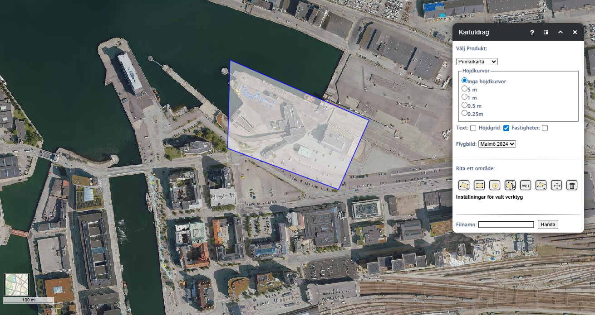

_Figure 5 - Ferry Terminal area with 2024 orthophoto and the 10 × 10 m analysis grid (Malmö internal GIS database)._

**Elevation data (DSM/DEM)**\
A DSM from Malmö’s GIS platform was used to represent the surface including buildings. A DEM (bare earth) was derived in QGIS. Both rasters were aligned to the grid and later used in UMEP.

**Land cover (before and after NbS)**\
Land cover was digitised and classified into paved, buildings, evergreen trees, deciduous trees, grass, bare soil and water. Two situations were defined:

* Baseline (“before NbS”): the land cover pattern is identical to the current situation except that the area where the urban forest is now located is reverted to paved apron surface in the grid. Port buildings, water and the small existing patches of grass and trees remain unchanged.
* Current state (“after NbS”): the urban forest planted in September 2025 is mapped as evergreen trees on the part of the apron that used to be paved.

**Urban forest polygons and climate data**\
The NbS design for the urban forest (Figure 6 and Figure 7) was imported as polygons and overlaid with the grid to identify which cells are affected by the intervention. A Copenhagen EPW file (DNK\_Copenhagen.061800\_IWEC.epw) was added as reference climate data for the region but is not used in the heat index calculations.

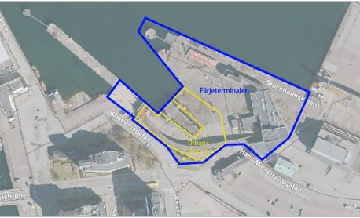

_Figure 6 - Plan view of the Ferry Terminal area, with the urban forest highlighted in yellow._

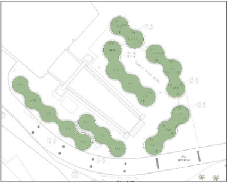

_Figure 7 - Detailed photo of the urban forest at the Ferry Terminal._

#### Step 2 – Derive morphology and land-cover fractions (UMEP)

**Land Cover Fraction (Grid)**\
The UMEP _Urban Land Cover: Land Cover Fraction (Grid)_ tool was run with the 10 × 10 m grid and the classified land-cover layer for the Ferry Terminal. It produced land-cover fraction fields for each grid cell (e.g. LCF\_\_Paved, LCF\_\_Buildings, LCF\_\_EvergreenTrees, LCF\_\_DecidiousTrees, LCF\_\_Grass, LCF\_\_Baresoil, LCF\_\_Water). These LCF values are used to characterise how much of each cell is sealed or vegetated and to construct the LC\_before and LC\_after scenarios.

**Morphometric Calculator (Grid)**\
The UMEP _Urban Morphology: Morphometric Calculator (Grid)_ was run with the DSM, DEM and the same 10 × 10 m grid. It produced morphology parameters such as building-height statistics (zH, zHmax, zHstd), roughness length (z0), displacement height (zd) and canopy indices (PAI/FAI). These outputs document the urban form of the Ferry Terminal.

**Anisotropic fractions**\
As part of the UMEP workflow, anisotropic land-cover fraction files (LC\_LCFG\_anisotropic\_result\_XX.txt) and morphology files for UWG (ferryterminal\_IMPGrid\_anisotropic\_XX.txt) were also generated. Are only documented and not used further in this CRA duo to error.

**Before/after land-cover fields**\
Based on the LCF outputs and the urban forest polygons, two categorical fields were defined for each grid cell:

* **LC\_before** – dominant land cover in the baseline with a paved ferry apron.
* **LC\_after** – dominant land cover in the current situation with the urban forest.

#### Step 3 – Evaluating Heat index

A simple static heat index was calculated to represent heat-stress. The index was defined as:

* Trees and grass (evergreen + deciduous trees, grass): **0.0** (low heat stress potential)
* Bare soil and water: **0.3** (medium heat stress potential)
* Paved surfaces and buildings: **0.7** (high heat stress potential)

Two fields were created in the grid: heat\_before – heat index for each cell in the LC\_before scenario and heat\_after – heat index for each cell in the LC\_after scenario.

#### Step4 – discussing results before and after Nbs implementation

**Before urban forest plantation (Nbs)**

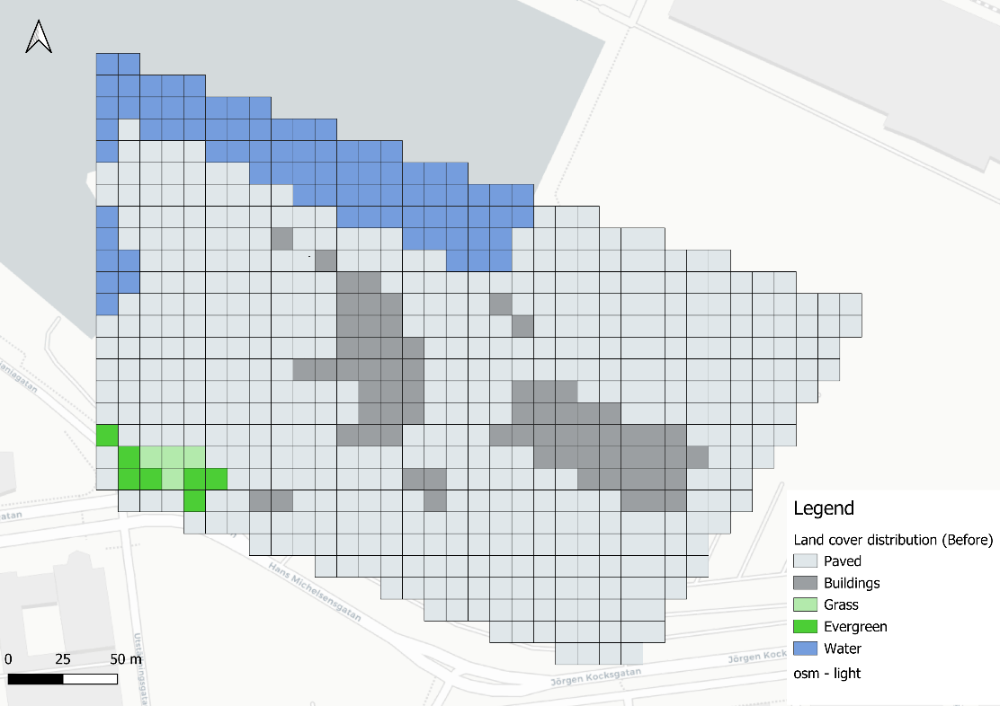

_Figure 8 - Land cover map of the Malmö Ferry Terminal area._

Figure 8 shows classifies surfaces into 5 types (deciduous and bare soil is not exicting or dominates one cellgrid): buildings, shown in darkgray, paved grey), vegetated areas (green), and water (blue). As seen above, the Ferry Terminal is overwhelmingly paved or built (large contiguous dark areas).

**After Nbs**

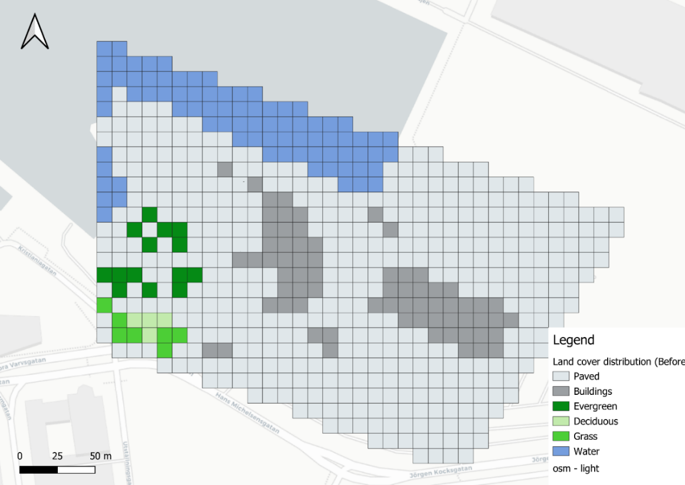

_Figure 9 - Land cover in the study area after implementation of the urban forest (current state, 2025)._

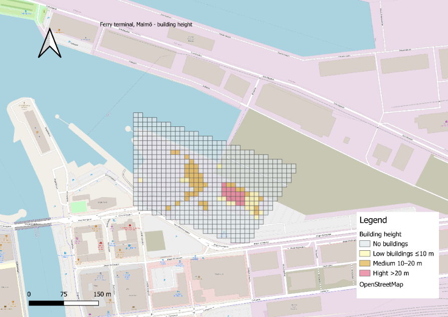

_Figure 10 - Building height distribution in the Ferry Terminal area._

|             |                                |                      |                      |                     |                     |
| ----------- | ------------------------------ | -------------------- | -------------------- | ------------------- | ------------------- |
| **LC code** | **Land-cover type**            | **Area before (m²)** | **Share before (%)** | **Area after (m²)** | **Share after (%)** |
| 1           | Paved                          | 45299                | 73.9                 | 43899               | 71.6                |
| 2           | Buildings                      | 6900                 | 11.3                 | 6900                | 11.3                |
| 3           | Evergreen trees (urban forest) | 0                    | 0                    | 1400                | 2.3                 |
| 4           | Deciduous trees                | 400                  | 0.7                  | 400                 | 0.7                 |
| 5           | Grass                          | 700                  | 1.1                  | 700                 | 1.1                 |
| 7           | Water                          | 8000                 | 13.1                 | 8000                | 13.1                |
| Total       |                                | 61299                |                      | 61299               |                     |

_Table 3 - Ferry terminal area and share before and after implementation of the urban forest._

**Heat index**

|                                   |           |          |
| --------------------------------- | --------- | -------- |
|                                   | **Value** | **Unit** |
| Max daily temperature             | 21.6      | °C       |
| Mean summer temperature (jun-aug) | 16.1      | °C       |
| Max hourly temperature            | 26.8      | °C       |

The three heat index classes represent relative surface and near surface temperatures on warm summer days. EPW data for Copenhagen show typical summer maximum air temperatures around 20–27 °C. Low (0.0) is coolest (trees/grass), medium (0.3) is warmer (water/bare soil), and high (0.7) is hottest (paving/buildings).

_Table 4 - Temperature Reference used: DNK\_Copenhagen.061800\_IWEC._

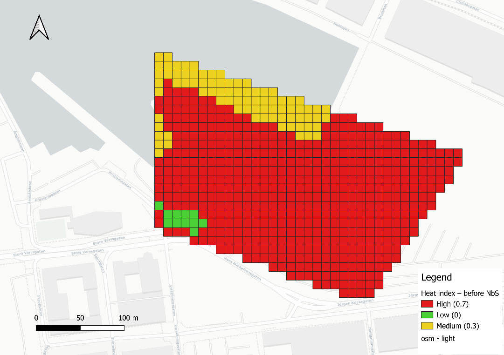

_Figure 11 - Ferry terminal – Heat exposure index before NbS implementation._

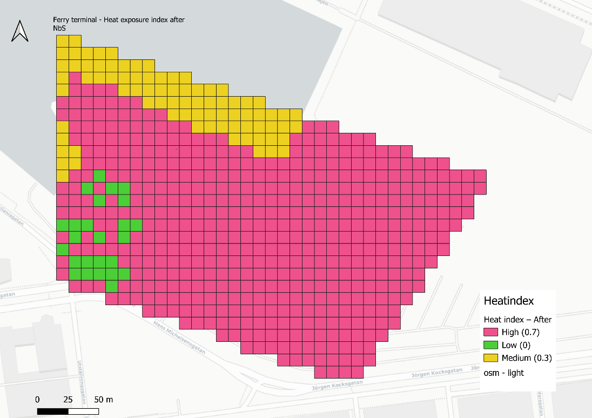

_Figure 12 - Ferry terminal – Heat exposure index after NbS implementation._

* **Observations on workflow current application**

> &#x46;_&#x72;om a user perspective, the Malmö case shows that using UMEP effectively benefits from some initial familiarisation and clear step-by-step guidance (module choice, execution order, and input preparation), as outcomes can depend on input formats and software versions. In this lab, additional time is needed to troubleshoot and validate the SVF, UWG and SOLWEIG workflows for the specific case-study setup._
>
> At the same time, Malmö sees clear value in UMEP as a planning support tool. With clearer guidance and more streamlined workflows, it could support climate-risk screening and the assessment of NbS and urban-design effects using multiple tools in combination.
>
> Once SVF/UWG/SOLWEIG components are successfully integrated, future iterations could move beyond land-cover screening towards modelling experienced heat (air temperature, radiant heat and thermal comfort), helping to identify local hotspots and quantify NbS effects.
>
> A key lesson learned is that the main bottleneck was not the method itself, but ensuring the workflow is reproducible (inputs, tool order, compatible versions) and applied at appropriate scales. In this case the ferry terminal is a small site (useful for local design), while some components may be better suited to neighbourhood or city scale, so clearer guidance on recommended scales would be beneficial.
