# D8.2 SLO-Podravje Region draft2

## Introduction and Objectives of the Climate Risk Assessment

### Regional context.

The [Podravje Region](https://en.wikipedia.org/wiki/Podravje_Statistical_Region), located in northeastern Slovenia, covers a diverse mix of urban, rural, and riverine landscapes, with key urban centres such as [Maribor](https://en.wikipedia.org/wiki/Maribor) (the country’s second largest city) and Ptuj (one of Slovenia’s oldest towns). The region is dominated by the [Drava River](https://en.wikipedia.org/wiki/Drava) basin and its tributaries, with fertile agricultural lowlands and a dense network of settlements. This geographic setting, coupled with changing climatic patterns, exposes the area to multiple climate-related hazards. Riverine and pluvial flooding and urban heatwaves are identified as priority risks in this tutorial. Drought and biodiversity loss also affect the region but are not addressed in detail in this first release.

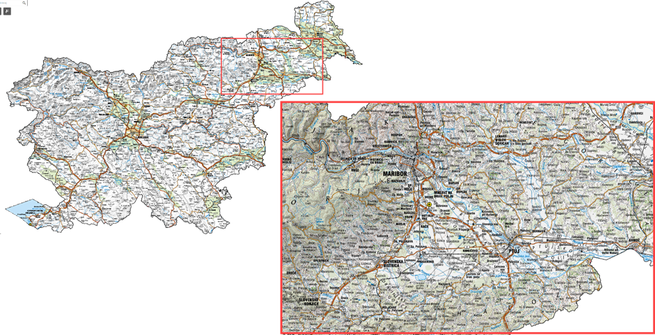

_Figure 1: Slovenia - Podravje Region (Atlas voda – DRSV; GURS; GEOZS; SAZU; ARSO, 2025)_

### Scope of the tutorial.

This tutorial describes a replicable Climate Risk Assessment (CRA) workflow for the two main hazards — floods (both fluvial and pluvial) and urban heatwaves — in the Podravje Innovation Lab. The approach does not require coding and relies on a combination of national datasets, proprietary and open-source tools, and publicly available European datasets to ensure transferability to other regions. The workflow supports integration of Nature-Based Solutions (NbS) and Blue-Green Infrastructure (BGI) into local and regional adaptation strategies, enabling assessment under current and projected climate scenarios.

* **Disclaimer**

> This tutorial is intended as a general workflow example and does not replace software-specific documentation (e.g., GIS, hydrological, hydraulic, or urban climate modelling tools user/technical manuals). Users should already be familiar with the relevant geospatial data formats, data pre-processing techniques, and modelling concepts applicable to their hazard of interest (e.g., floods, UHIs, droughts, etc.), as well as with the specific input/output requirements and run functionalities of the modelling software before attempting to replicate this workflow

### CRA objectives.

The Podravje CRA aims to:

**Understand vulnerabilities** — Identify communities, ecosystems, and infrastructure most exposed to floods and heatwaves.

**Characterize hazards** — Analyze current and future climate conditions using observed data, climate projections, and socio-economic scenarios.

**Assess impacts** — Quantify exposure and potential consequences across key sectors such as agriculture, infrastructure, water resources, health, and biodiversity.

**Prioritize adaptation measures** — Identify where NbS and BGI can deliver the highest resilience gains and co-benefits.

**Support planning and policy** — Provide evidence for land-use planning, emergency preparedness, and regional development strategies.

**Enable monitoring** — Define baseline indicators and monitoring frameworks to track hazard trends and adaptation effectiveness over time.

### Intended users.

For both hazards, the Climate Risk Assessment is intended for r**egional and municipal authorities** who need to integrate hazard and exposure data into spatial and emergency planning, civil protection **agencies** responsible for preparedness and response to extreme events, and **environmental NGOs and research institutions** engaged in monitoring, restoration, and public outreach. **Policy-makers** and **land managers** also use the results to design adaptive regulations and direct investments where resilience measures can provide the greatest benefits.

In the Podravje context, this means that flood hazard outputs support zoning, infrastructure planning, and the identification of priority areas for floodplain restoration, while heatwave assessments guide urban greening strategies, cooling infrastructure placement, and health risk reduction measures in vulnerable districts.

## Flood Hazard – Podravje Region

### Description and context

The Podravje Region is exposed to two main types of flooding: **fluvial flooding** from the Drava River and its tributaries, and **pluvial flooding** resulting from intense rainfall events. Both hazards affect urban areas such as Maribor and Ptuj, as well as surrounding agricultural lowlands. Historic events have caused significant damage to farmland, settlements, transport infrastructure, and cultural heritage.

Climate projections indicate an increased frequency of extreme precipitation, which will likely amplify both flood extent and depth in the future. The regional adaptation strategy promotes **Nature-Based Solutions (NbS)** and **Blue-Green Infrastructure (BGI)**, for example Restoration of wetlands and riparian zones along the Drava River to reduce flood risk and enhance biodiversity.

|                       |                                                                            |                 |                                                                      |
| --------------------- | -------------------------------------------------------------------------- | --------------- | -------------------------------------------------------------------- |
| **Dimension**         | **Indicator(s)**                                                           | **Unit**        | **Purpose**                                                          |
| Flood extent & depth  | Flooded area and maximum water depth by return period (10, 100, 200 years) | km², m          | Identify hazard zones, quantify severity, and guide design standards |
| Frequency & intensity | Return period statistics and climate-adjusted scenarios                    | Years, % change | Evaluate changing hazard probability under climate change            |

_Table 1 – key indicators tracked-Flood Hazard_

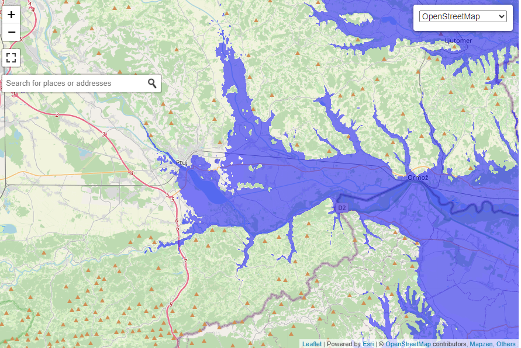

_Figure 2 – example of flood risk map for Flood map Slovenia – river Drava in its downstream in Slovenia._

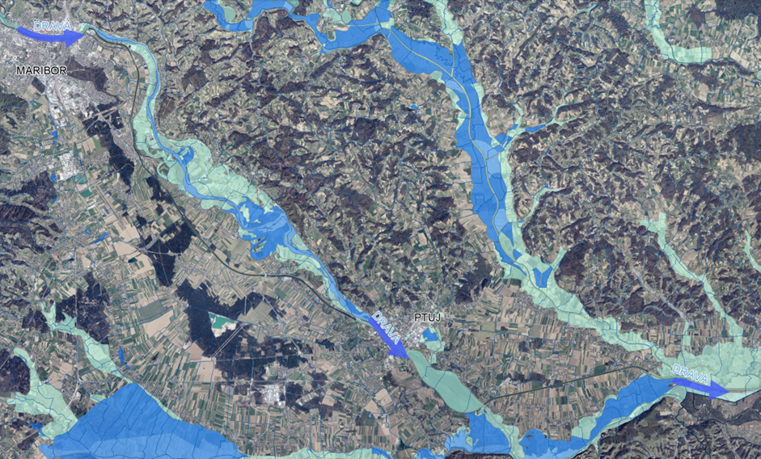

_Figure 3 – example of flood risk map for Flood map Slovenia – river Drava in its downstream in Slovenia (Atlas voda – DRSV; GURS; GEOZS; SAZU; ARSO, 2025). Data sources and tools_

Flood risk assessment in Podravje relies on an integrated set of **hydrological**, **topographic**, and **land use** datasets.

Hydrological data form the backbone of the workflow. The Slovenian Environment Agency (ARSO) provides estimation of a peak discharge at selected stations for specific return periods (e.g. 10, 100, 500 years) to be used directly in hydraulic models.

Historical flood event records may also be consulted to validate hazard maps and identify vulnerable locations.

High-resolution **LiDAR-based Digital Terrain Models (1 m and 0,5m)** provide the topographic base for hydraulic simulations and floodplain delineation, while land use and cover maps from the Slovenski INSPIRE system define runoff characteristics and support exposure analysis.

For regional transferability or gap-filling, **Copernicus DEM** (10–30 m), **Copernicus Climate Data Store** hydrology-related impact indicators, and harmonized land cover datasets (CLCplus Backbone, Urban Atlas) may be explored.

| **Data type**                                    | **Source**                                                                                                               | **Role in workflow**                                                                       | **Open/EU alternative**                                                                                                                                                                                                                                                                                                                                                   |
| ------------------------------------------------ | ------------------------------------------------------------------------------------------------------------------------ | ------------------------------------------------------------------------------------------ | ------------------------------------------------------------------------------------------------------------------------------------------------------------------------------------------------------------------------------------------------------------------------------------------------------------------------------------------------------------------------- |
| Annual max river discharge values                | [ARSO gauging stations](https://vode.arso.gov.si/hidarhiv/pov_arhiv_tab.php)                                             | Input to flood frequency analysis (if official extreme flood statistics are not available) | None (site-specific)                                                                                                                                                                                                                                                                                                                                                      |
| Historical flood event data and flood statistics | [ARSO publications](https://www.arso.gov.si/vode/podatki/)                                                               | Input for flood hazard maps                                                                | Copernicus [Hydrology-related climate impact indicators from 1970 to 2100 derived from bias adjusted European climate projections](https://cds.climate.copernicus.eu/datasets/sis-hydrology-variables-derived-projections?tab=overview) (daily values only)                                                                                                               |
| Digital Terrain Model (1 m LiDAR)                | [ARSO Geoportal](https://gis.arso.gov.si/evode/profile.aspx?id=atlas_voda_Lidar@Arso)                                    | Hydraulic model topography; floodplain delineation                                         | [Copernicus DEM](https://dataspace.copernicus.eu/explore-data/data-collections/copernicus-contributing-missions/collections-description/COP-DEM) (10–30 m)                                                                                                                                                                                                                |
| Digital Terrain Model (05 m LiDAR)               | [https://clss.si/](https://clss.si/)                                                                                     | Hydraulic model topography; floodplain delineation                                         | [Copernicus DEM](https://dataspace.copernicus.eu/explore-data/data-collections/copernicus-contributing-missions/collections-description/COP-DEM) (10–30 m)                                                                                                                                                                                                                |
| Land use / land cover                            | [Slovenski INSPIRE,](https://eprostor.gov.si/imps/srv/eng/catalog.search#/metadata/49c8dd3a-e5db-4ed1-8bf1-e1b7def60dd0) | Exposed assets overlay                                                                     | 
Copernicus <a href="https://land.copernicus.eu/en/products/urban-atlas">Urban Atlas</a>

<a href="https://land.copernicus.eu/en/products/clc-backbone">CLCplus Backbone</a>
                                                                                                                                                                                   |
| Building Footprints                              | [Slovenski INSPIRE](https://eprostor.gov.si/imps/srv/eng/catalog.search#/metadata/9a8fd241-9162-407c-94e7-c98e05766881)  | Exposed assets overlay, DTM correction to consider building presence                       | 
OpenStreetMap building layer (<a href="https://osmbuildings.org/">vector, global)</a>

Copernicus <a href="https://land.copernicus.eu/en/products/urban-atlas">Urban Atlas</a> (harmonised land use and land cover maps as well as information on <a href="https://land.copernicus.eu/en/products/urban-atlas?tab=building_height">building block heights</a>
 |

_Table 2 – used data, an alternative dataset to replicate the assessment outside the study area, when available_

* **Climate change effects on hydrological extremes**

> _Although the current workflow does not incorporate official climate projections, a first approximation of future flood hazards, if not available from local studies, may be derived using open datasets from the Copernicus Climate Data Store. These include bias-adjusted impact indicators such as daily river discharge extremes under different climate scenarios (e.g. RCP 8.5)._
>
> _A practical example of this approach has been implemented_ [_here_](https://www.euspa.europa.eu/newsroom-events/success-stories/copernicus-hydropower-flood-assessments) _for a hydropower site in Switzerland, where Copernicus climate projections, coupled with limited gauging station statistics for basic downscaling, were used to estimate future 100-year flood discharges and run simplified hydraulic simulations to assess potential downstream impacts. The methodology explores how to use Copernicus datasets to create a preliminary “climate-adjusted” flood map._

**The following tools**, both proprietary and open-source, can be used in the Podravje flood hazard workflow to acquire, process, and model hydrological and spatial data, to generate decision-ready outputs and replicate the assessment in other regions:

|                                                                                                                              |             |                                                                                                                   |
| ---------------------------------------------------------------------------------------------------------------------------- | ----------- | ----------------------------------------------------------------------------------------------------------------- |
| **Tool**                                                                                                                     | **Type**    | **Role**                                                                                                          |
| [HEC-RAS](https://www.hec.usace.army.mil/software/hec-ras/download.aspx)                                                     | Open        | Hydraulic modelling of riverine and pluvial floods                                                                |
| [HEC-HMS](https://www.hec.usace.army.mil/software/hec-hms/)                                                                  | Open        | HEC-HMS is used to simulate rainfall–runoff processes and generate design hydrographs for hydrological modelling. |
| [ArcGIS Pro Flood Simulation](https://pro.arcgis.com/en/pro-app/latest/help/mapping/simulation/simulation-in-arcgis-pro.htm) | Proprietary | GIS based flood modeling tool                                                                                     |
| [SaferPlaces](https://saferplaces.co/)                                                                                       | Proprietary | Cloud-based hazard modelling for fluvial, pluvial and coastal flooding scenarios                                  |
| [QGIS](https://qgis.org/)                                                                                                    | Open        | Spatial analysis, mapping, and hazard–exposure overlay                                                            |
| [ArcGIS Pro](https://www.esri.com/en-us/arcgis/products/arcgis-pro/overview)                                                 | Proprietary | Spatial analysis, mapping, and hazard–exposure overlay                                                            |

_Table 3 – used tools and role in the Flood Hazard workflow, when available a free similar alternative to proprietary solutions is provided._

### Methodology

**Study Area Overview – Ptuj, Ljudski Vrt Park**

The modelling example focuses on the Ljudski Vrt urban park in Ptuj, where a small catchment of approximately 0.40 km² drains into an artificial pond fed by a steep, forested hillside stream.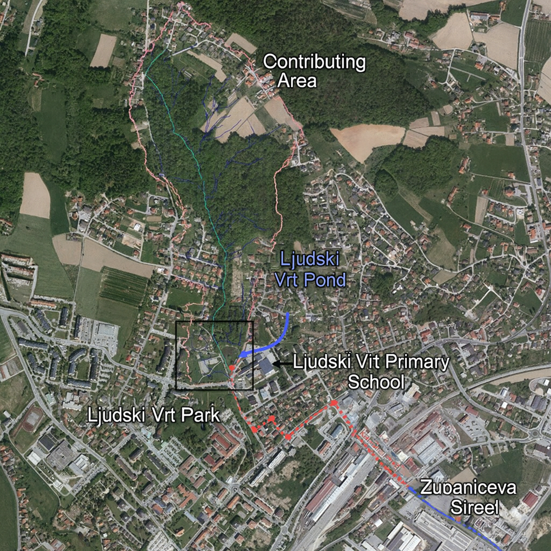

_Figure 4 - Study area (source: VGP Drava, d.o.o.; GURS DOF)_

Due to high runoff velocities and limited downstream conveyance capacity (1.12–1.26 m³/s), intense rainfall events frequently caused rapid water-level rise and overflow toward the Ljudski Vrt Primary School and Župančičeva Street. Historical flooding, combined with reduced pond storage caused by sediment accumulation, made the area a representative case for demonstrating flood-mitigation modelling. The implemented solution—a dry retention basin with controlled overflow and drainage—serves as the baseline scenario for illustrating the flood-hazard assessment workflow.

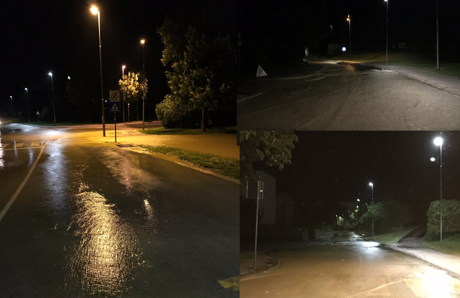

_Figure 5 - Flooding at the outflow of the Ljudski Vrt pond toward Župančičeva Street (Right – intersection with 5. Prekomorska Street; Left – Župančičeva Street toward Potrčeva Road). (source: Neven Vednik, 4 April 2018)_

#### Step 1 - Data acquisition and preparation

Download local hydrological time series of maximum peak flood or directly official floods statistics for target stations. These will be used for local flood model input (“design events”)

Hydrological Data – Summary for Step 1

For the Ljudski Vrt case study, hydrological inputs were derived from a combination of local measurements, national datasets, and catchment-based modelling. The contributing catchment (≈0.40 km²) was delineated using LiDAR-based terrain data, while land-use information was used to determine runoff characteristics (CN values).

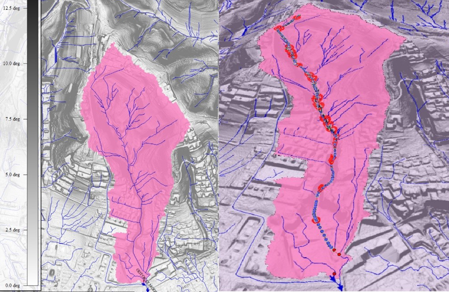

_Figure 6 - 2D and 3D view of contributing catchment of the Ljudski Vrt torrent (Source: ARSO LIDAR, hydrological model)._

Extreme rainfall data were obtained from the nearest ARSO meteorological station (Mestni Vrh), providing intensity–duration–frequency information for events with 10-, 100-, and 500-year return periods.

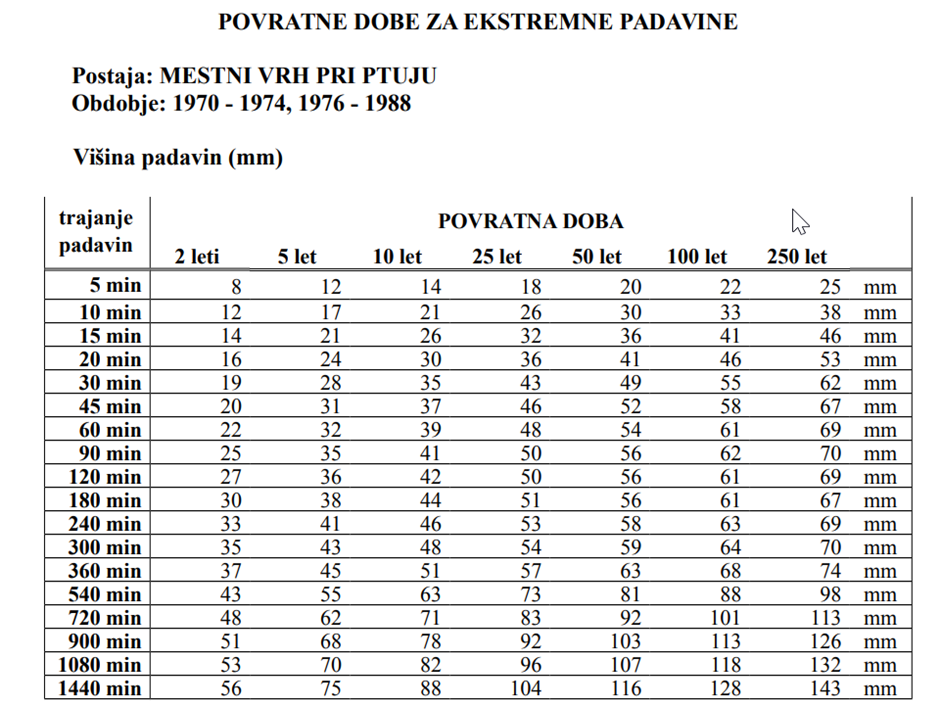

_Figure 7 - Extreme rainfall intensities for the Mestni Vrh rain gauge near Ptuj (Source:_ [_ARSO_](https://meteo.arso.gov.si/uploads/probase/www/climate/table/sl/by_variable/return-periods/Mestni%20Vrh%20pri%20Ptuju.pdf)_)._

Surface runoff was simulated using the HEC-HMS model with the SCS methodology, producing design hydrographs for each return period. These hydrographs serve as upper boundary conditions for the hydraulic model and represent the primary input for flood-hazard simulations.

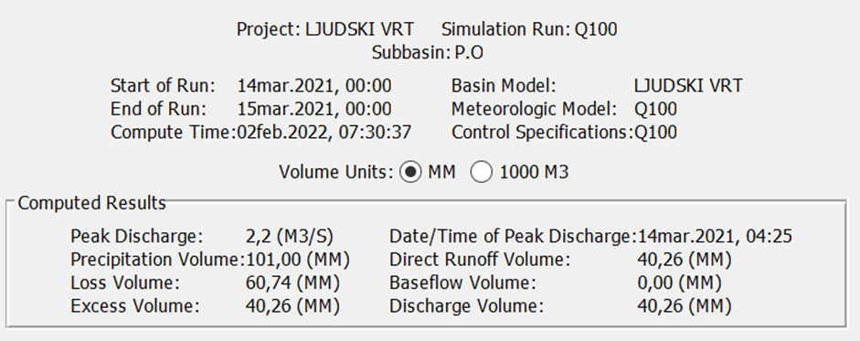

_Figure 8 - Surface Runoff Simulation results – HEC-HMS_

**Terrain and Land-Cover Inputs (LiDAR, Land Use, Roughness) – Summary for Step 1**

Using GIS tools prepare terrain from high resolution LiDAR DTM (e.g. mosaic tiles in the area of interest, enforce structures such as buildings). Please note that Lidar datasets have no information on underwater topography (Figure 9), this may be derived from local bathymetric surveys or, in the worst case, estimated.

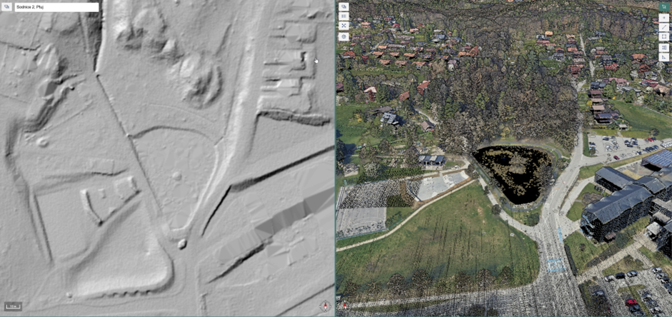

_Figure 9 – example of Lidar DTM from ARSO geoportal compared to raw point cloud map, obstacles such as buildings and trees are filtered from the terrain surface. Underwater topography is not represented (source_ [_CLSS_](https://clss.si/)_)._

Harmonize land use/cover for roughness and exposure in GIS. Depending on the flood modeling tool you are using, this layer may serve as a basemap to assign surface roughness values as well

In Ljudski Vrt case study Manning roughness coefficients were assigned using publicly available land-cover datasets (Corine Land Cover – CLC) and high-resolution orthophotos (GURS, 2022).

For the channel, values between n = 0.035–0.038 were applied, while land-cover-specific roughness values for the 2D hydraulic model were defined as follows: trees and shrubs 0.08, open water 0.035–0.038, forest 0.08, built-up and paved surfaces 0.06, buildings 0.99, and grassland 0.04.

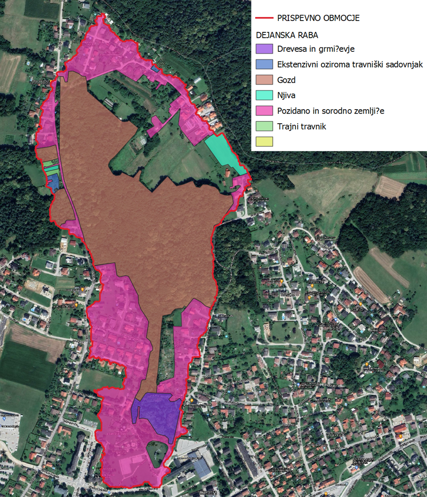

_Figure 10 - Land-use map (Source: Ministry of Agriculture, Forestry and Food – Register of Actual Use of Agricultural and Forest Land)_

Gather boundary conditions for upstream inflows (peak flow for assigned return time of interest), tributaries if present and downstream conditions (e.g. energy slope)

#### Step 2 - Model setup and run

Define the hydraulic domain and scheme (1D/2D/coupled) with a stable mesh; assign Manning’s n from land-use classes. Configure steady or unsteady simulations depending on the hydrological input available and your time computation resources constraint. Depending on the model complexity and data volume, this may involve use of local hardware, for smaller-scale or less complex simulation or Cloud-Based Platform, for large-scale, data-intensive simulations requiring significant computational power.

Import topography (DTM) and modify it to consider underwater topography, presence of structures such as levees of relevant hydraulic structures (such as weirs or bridges) m please refer to the flood modeling tool manual for details.

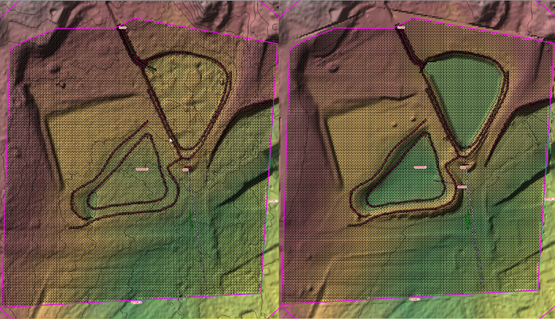

_Figure 11 – Representation of the 2D hydraulic model domain (existing and proposed conditions) in Ljudski vrt._

If you have reference maps (e.g. Figure 2) or observed stages corresponding to observed flows you may first calibrate your model to reproduce such event, then run design events (e.g., 10, 100, 500-year) to produce maximum water surface, depth, and velocity raster.

**Note: river modeling**

> **Where no detailed modeling of the river is possible** nor of interest (e.g. for lack of river cross sections or presence of stable embankments) an alternative approach is estimating **flood volume outside of the river** (e.g. a fraction of the expected event volume in the river) and simulating a flood domain outside of the river, as in the example of Figure 7

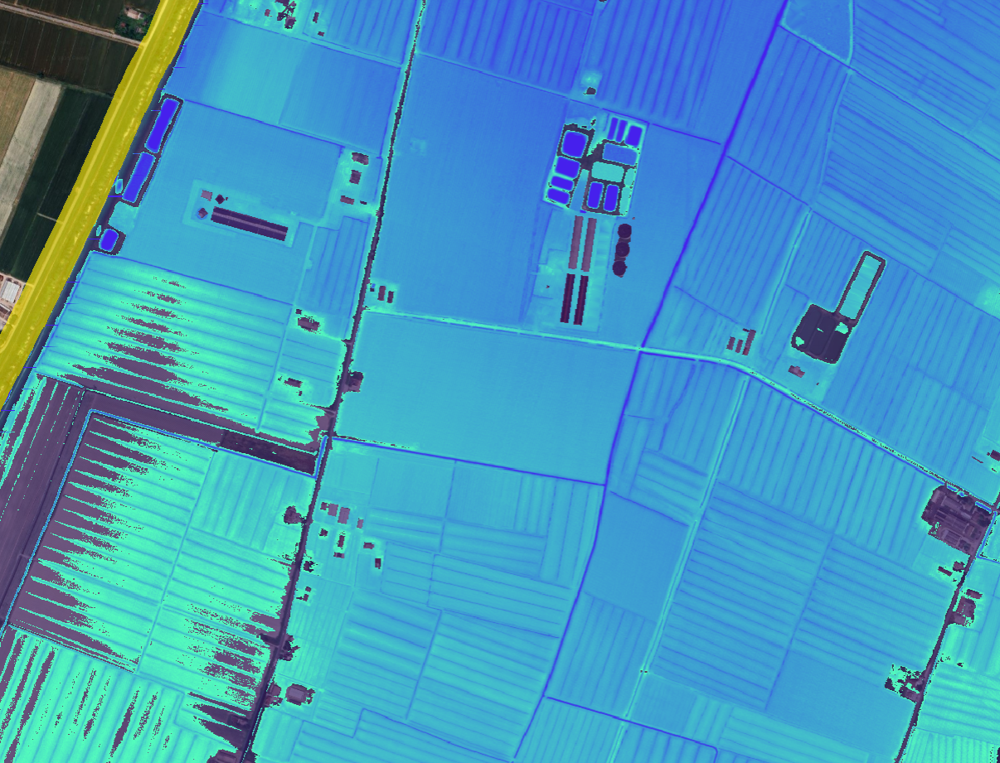 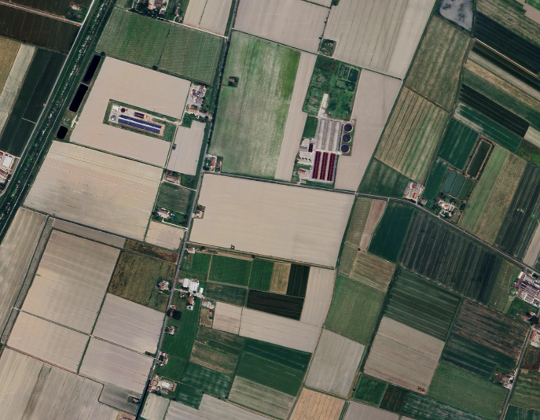

_Figure 12 – example of flood maps for a generic lowland area, derived by 2d Modeling of estimated flood volumes outside of the river, courtesy of_ [_SaferPlaces_](https://saferplaces.co/rimini-and-climate-change-the-added-value-of-the-sea-park-parco-del-mare/) _platform._

Optionally, derive **climate-adjusted variants** by scaling design flows with CDS indicators consistent with local gauges (see note in the Data sources and tools section)

#### Step 3 - Analysis and interpretation

Post-process water depth raster maps, eventually velocity maps may be loaded into GIS environment to plot extent and to classify hazard (e.g. water depth ranges)

Overlay hazard with buildings, infrastructure, land use or other relevant exposure layers (e.g. population) to quantifying potential losses and social impacts, including affected populations and critical infrastructure.

In the Ljudski Vrt case study, the hydraulic outputs from the 2D HEC-RAS model were analysed to evaluate flood propagation under the 10-, 100-, and 500-year design hydrographs derived from the HEC-HMS hydrological model. Water-depth rasters were classified into standard hazard categories (<0.5 m, 0.5–1.5 m, >1.5 m) to identify areas where overflowing from the pond threatens the Ljudski Vrt Primary School and adjacent residential zones. The simulations confirmed that, under pre-project conditions, floodwaters exceed the pond banks on the southern and eastern sides and propagate toward Župančičeva Street and the school complex. Model validity was checked using observed historical flooding extents (e.g., events of 2018) and local testimonies, showing high consistency between the simulated and observed flood patterns. These analytical layers form the basis for evaluating exposure, potential damage, and for comparing baseline versus mitigation scenarios.

_Figure 13 - Flood extent under pre-project conditions for the 100-year discharge scenario._

_Figure 14 - Flood extent under post-project conditions for the 100-year discharge scenario, including residual flooding areas for the 500-year event (black outline)._

#### Step 4 - NbS testing for fluvial mitigation

Screen reaches for floodplain reconnection, riparian and wetland restoration, levee flood protection areas

Implement simple what-if runs or scenario including presence of Nbs modification in the flood model (step 2,) to compare baseline vs NbS options

Eventually, use GIS to derive performance indicators and statistics such as peak stage reduction, flooded area change, and number of exposed assets.

Nature-Based Solution (NbS) testing focused on evaluating the performance of the newly implemented dry retention basin integrated into the existing park area and its associated landscape modifications in reducing peak water levels and downstream flood impacts. The NbS intervention consists of a reshaped terrain forming a temporary storage volume, a low retention embankment, a controlled outlet structure regulating discharge, and an emergency overflow crest designed to safely convey excess water during extreme events. Under normal hydrological conditions, the area functions as a public green space, while during intense rainfall events it temporarily stores runoff and releases it in a controlled manner, combining flood risk reduction with ecological and recreational functions.

The 2D model was re-run with the updated terrain (retention embankment, overflow crest, drainage platform, and controlled outlet structure). Results show that, during the 100-year event, the storage volume within the retention zone limits the water level to the design elevation (236.0 m a.s.l.), preventing overflow toward the school and built-up areas. Only during the 500-year scenario does the emergency spillway activate, directing excess water in a controlled manner along the roadway without affecting critical assets. The comparison demonstrates a substantial reduction in flood extent and hazard classes, confirming that the NbS-oriented retention intervention effectively attenuates peak flows and mitigates fluvial flood risk while maintaining the ecological and landscape function of the park.

## Heatwave Hazard – Podravje Region

### Description and context

The Podravje Region experiences increasingly frequent and intense **heatwaves**, with the highest impacts concentrated in urban areas such as Maribor and Ptuj. The [\*\* Urban Heat Island (UHI)\*\*](https://land.copernicus.eu/en/feature-articles/urban-heat-islands-measured-mapped-and-managed) effect amplifies thermal stress in dense built-up districts, where impervious surfaces and limited vegetation lead to higher air and surface temperatures compared to surrounding rural areas.

These conditions pose health risks, especially for vulnerable populations (elderly, children, people with pre-existing health conditions), reduce thermal comfort, and exacerbate energy demand for cooling. Climate projections indicate a further increase in the frequency, intensity, and duration of heatwave events in the coming decades.

Historical climate data already show clear warming trends in Slovenia. The comparison of average July temperatures between the e periods 1971–2000 and 1981–2010 reveals a consistent increase across the country, while the deviation map highlights areas with the most pronounced anomalies. These patterns underline the growing relevance of heatwave and UHI assessments in the Podravje Region (Figure 15,Figure 16)

> 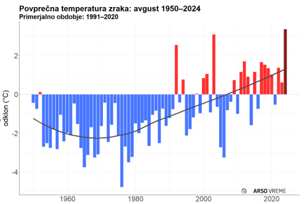

_Figure 15 - Deviation of average temperature in Slovenia._

> 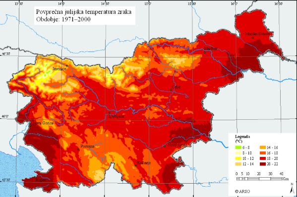
>
> 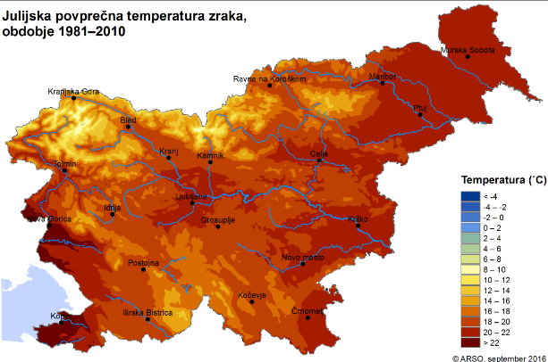

_Figure 16 -Comparison of average temperature in July (left period 1971-2000, right: period 1981-2010)_

Adaptation strategies for the heatwave hazard focus on **Nature-Based Solutions (NbS)** and **Blue-Green Infrastructure (BGI)** to mitigate the UHI effect, including expansion of urban tree canopy, creation of green corridors, installation of green roofs and walls, and integration of water features for evaporative cooling.

|                          |                                                |          |                                             |
| ------------------------ | ---------------------------------------------- | -------- | ------------------------------------------- |
| **Dimension**            | **Indicator(s)**                               | **Unit** | **Purpose**                                 |
| UHI extent & intensity   | Temperature anomaly vs rural baseline          | °C, km²  | Identify and map urban heat hotspots        |
| Heatwave characteristics | Duration, frequency, maximum daily temperature | Days, °C | Quantify hazard severity and monitor trends |

_Table 4 – key indicators tracked-UHI Hazard_

### Data sources and tools

Assessment of heatwave risk and UHI patterns in Podravje requires a combination of meteorological, remote sensing, and land use datasets.

**Meteorological data** from ARSO provide daily maximum and mean air temperatures, as well as humidity, wind speed, and solar radiation, enabling the identification of extreme heat events and the calculation of relevant indices.

**Remote sensing data**, such as Landsat and Sentinel-3 imagery, supply Land Surface Temperature (LST) maps to detect and quantify UHI intensity.

**Land use and morphology datasets**, including building footprints and heights (Slovenski INSPIRE, Urban Atlas), are used to analyze the spatial configuration of heat hotspots.\
For future climate projections, bias-adjusted datasets from the **Copernicus Climate Data Store** offer temperature scenarios aligned with regional climate models.

Following table illustrates example datasets:

| **Data type**                          | **Source**                                                                                                                                                                                                                      | **Role in workflow**                                                                               | **Open/EU alternative**                                                                                                                                                                                                                                                                                                                                                                        |
| -------------------------------------- | ------------------------------------------------------------------------------------------------------------------------------------------------------------------------------------------------------------------------------- | -------------------------------------------------------------------------------------------------- | ---------------------------------------------------------------------------------------------------------------------------------------------------------------------------------------------------------------------------------------------------------------------------------------------------------------------------------------------------------------------------------------------- |
| Digital Terrain Model (1 m LiDAR )     | [ARSO Geoportal](https://gis.arso.gov.si/evode/profile.aspx?id=atlas_voda_Lidar@Arso)                                                                                                                                           | Base terrain morphology for heat modeling                                                          | No open alternative general DTM available at the resolution required for such analysis, explore your national- regional geoportals for lidar datasets                                                                                                                                                                                                                                          |
| Digital Surface Model (DSM             | Derived from original LiDAR LAS files available on the [ARSO Geoportal](about:blank)                                                                                                                                            | Required for representing building and vegetation heights in heat modelling.                       |                                                                                                                                                                                                                                                                                                                                                                                                |
| hourly temperature & climate variables | [ARSO meteorological network](https://meteo.arso.gov.si/met/sl/app/webmet/#webmet==8Sdwx2bhR2cv0WZ0V2bvEGcw9ydlJWblR3LwVnaz9SYtVmYh9iclFGbt9SaulGdugXbsx3cs9mdl5WahxXYyNGapZXZ8tHZv1WYp5mOnMHbvZXZulWYnwCchJXYtVGdlJnOn0UQQdSf) | Provide Meteo input to heat stress an analysis, see note on the meteorological inputs              | 
Copernicus <a href="https://cds.climate.copernicus.eu/datasets/reanalysis-era5-land?tab=download">ERA5-Land hourly data from 1950 to present</a>

<a href="https://cds.climate.copernicus.eu/datasets/sis-heat-and-cold-spells?tab=overview">Heat waves and cold spells in Europe derived from climate projections</a>
                                                             |
| Land Surface Temperature (LST)         |                                                                                                                                                                                                                                 | Map UHI presence via Satellite-Based Thermal Imaging                                               | [Landsat8](https://rslab.gr/Landsat_LST.html) derived land surface temperature maps                                                                                                                                                                                                                                                                                                            |
| Land use / land cover                  | [Slovenski INSPIRE,](https://eprostor.gov.si/imps/srv/eng/catalog.search#/metadata/49c8dd3a-e5db-4ed1-8bf1-e1b7def60dd0)                                                                                                        | UHI drivers and green areas                                                                        | 
Copernicus <a href="https://land.copernicus.eu/en/products/urban-atlas">Urban Atlas</a>

<a href="https://land.copernicus.eu/en/products/clc-backbone">CLCplus Backbone</a>
                                                                                                                                                                                                        |
| Building Footprints                    | [Slovenski INSPIRE metapodatkovni sistem](https://eprostor.gov.si/imps/srv/eng/catalog.search#/metadata/9a8fd241-9162-407c-94e7-c98e05766881)                                                                                   | 
local topography modification in detailed modeling

building height shall be estimated
 | 
OpenStreetMap building layer (<a href="https://osmbuildings.org/">vector, global)</a>

Copernicus <a href="https://land.copernicus.eu/en/products/urban-atlas">Urban Atlas</a> (harmonised land use and land cover maps as well as information on <a href="https://land.copernicus.eu/en/products/urban-atlas?tab=building_height">building block heights</a> and street trees for
 |
| Population                             | Statistical Office of the Republic of Slovenia [(SURS). (2025)](https://www.stat.si/obcine/en/Municip/Index/130). Municipality of Ptuj – basic data.                                                                            | Overlay to heat stress, to detect where UHI exacerbate public health risks                         |  [World pop Hub](https://dx.doi.org/10.5258/SOTON/WP00646)                                                                                                                                                                                                                                                                                                                                     |
| Vegetation                             | Vegetation height data can be obtained from LiDAR survey datasets provided by Centralni lidar sistem Slovenije [(CLSS)](https://clss.si/) or, height can be assigned to vegetation based on DSM-DTM difference                  | Map vegetation to estimate vegetation height above ground when no DSM is available                 | Copernicus High Resolution Layer [Tree Cover and Forests](https://land.copernicus.eu/en/products/high-resolution-layer-forests-and-tree-cover) (raster 10m)                                                                                                                                                                                                                                    |

_Table 5 – used data, an alternative dataset to replicate the assessment outside the study area, when available_

*   **meteorological inputs**

    _Meteorological input requirements and formatting vary depending on the modelling code used. For UHI simulations with UMEP (Table 2), the required variables include air temperature, dew point or relative humidity, surface pressure, wind speed and direction, shortwave radiation (global, diffuse and direct), longwave radiation, precipitation, and cloud cover. UMEP relies on the **EPW format (EnergyPlus Weather)**. EPW files are “typical meteorological dataset with a typical year” and can be downloaded from several sources (e.g. EnergyPlus , EPWmap ) or generated from reanalysis datasets such as **ERA5(-Land)**. Users are encouraged to download the file closest to their location and **adapt it with local meteorological data**, so that the weather inputs reflect the actual conditions of the study area._

> _Free tools are available to inspect and modify EPW files, such as_ [_Elements_](https://bigladdersoftware.com/projects/elements/)_. We recommend changing the epw file after reading the official **UMEP documentation and tutorial examples** (Table 2) to adjust the variables, ensuring that the file accurately represents both the local climate data and the modelling requirements._

The following tools, combining GIS platforms, remote sensing processors, and urban climate modelling software, can be used in the Podravje heatwave workflow to process temperature and land cover data, map UHI patterns, and test the effectiveness of mitigation strategies under current and projected climate scenarios.

| **Tool**                                                                                                                                                                                                                                                             | **Type**    | **Role**                                                                                                               |
| -------------------------------------------------------------------------------------------------------------------------------------------------------------------------------------------------------------------------------------------------------------------- | ----------- | ---------------------------------------------------------------------------------------------------------------------- |
| [QGIS](https://qgis.org/)                                                                                                                                                                                                                                            | Open        | Spatial analysis and mapping of UHI hotspots; integration of temperature, land cover, vegetation, and demographic data |
| [ArcGIS Pro](https://www.esri.com/en-us/arcgis/products/arcgis-pro/overview)                                                                                                                                                                                         | Proprietary | Advanced spatial analysis, 3D visualization, and map production for UHI and heat stress assessments                    |
| 
<a href="https://umep-docs.readthedocs.io/projects/tutorial/en/latest/Tutorials/UWGSpatial.html">UMEP</a> (QGIS plugin) <a href="https://umep-docs.readthedocs.io/projects/tutorial/en/latest/Tutorials/TARGETTutorial.html">Tutorials</a> a are available
 | Open        | Urban climate modelling, including UHI mapping and scenario analysis using Urban Weather Generator (UWG)               |
| [ENVI-met](https://envi-met.com/)                                                                                                                                                                                                                                    | Proprietary | 3D microclimate modelling to simulate temperature distribution, vegetation effects, and NbS cooling potential          |

_Table 2 – used tools and role in the UHI workflow, when available a free similar alternative to proprietary solutions is provided._

### Methodology – Step-by-step

Study Area Overview – Q-Center Ptuj

The study area focuses on the parking area in front of the Q-Center shopping centre in Ptuj, located in a highly urbanised commercial zone with extensive sealed surfaces. The parking area covers approximately 0.22 ha and is currently fully asphalted, with no tree canopy, green infrastructure, or permeable surfaces. As such, it represents a typical example of an urban heat hotspot during summer heatwave conditions.

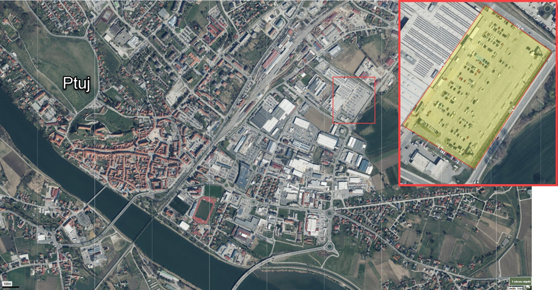

_Figure 17 – Center study area._

Given the absence of implemented reference projects in Ptuj, the assessment adopts solutions derived from a comparable nearby town, Slovenska Bistrica, where a small-scale green parking area has been constructed in recent years. This project serves as a local, context-specific example of how parking infrastructure can be redesigned to reduce heat stress while maintaining functionality.

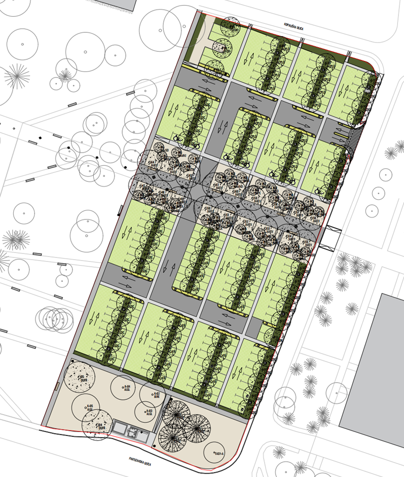

_Figure 18- Layout of the green parking area used as a reference case study in Slovenska Bistrica._

The green parking area in Slovenska Bistrica replaces conventional asphalt with permeable pavement systems, integrates vegetated strips and infiltration zones, and includes tree planting for shading. The key characteristics of the intervention are a reduced share of impervious surfaces, increased evapotranspiration potential, and significant shading of parking spaces during peak summer hours. These elements contribute to lower surface temperatures and improved thermal comfort for users.

For the purposes of this study, the design principles and functional characteristics of the Slovenska Bistrica green parking were transferred and upscaled conceptually to the Q-Center Ptuj site. The scenario therefore represents a hypothetical “what-if” transformation, illustrating the potential impact of replacing the existing asphalt parking area with a green parking solution under similar climatic and urban conditions. This approach enables a realistic, locally grounded assessment of heatwave hazard reduction, while clearly distinguishing between existing conditions and scenario-based assumptions.

#### Step 1 – Data acquisition and preparation

Obtain historical temperature and humidity series from **ARSO** to define baseline climatic conditions and detect past extreme heat events. Complement these with **land use and land cover** layers from Slovenski INSPIRE or Copernicus Urban Atlas, including vegetation cover, building footprints, and building heights derived from **DSM generated from LiDAR LAS** files. Add **population datasets** (e.g., WorldPop) to assess exposure and identify vulnerable communities. All datasets should be converted into a **GIS-compatible format**.

Retrieve **cloud-free Landsat-derived Land Surface Temperature (LST)** images for peak summer periods (Figure 19). In GIS, classify LST values into indicative temperature ranges (e.g., < 25 °C, 25–35 °C, > 45 °C) to produce a first proxy map of UHI zones.

For microclimate modelling, these layers often require reformatting to match the input structure of the chosen modelling framework (e.g., ENVI-met, UMEP). This includes:

* Classifying land cover into model-compatible categories
* Generating continuous DTM and DSM surfaces
* Attributing building polygons with height and material properties
* Preparing hourly meteorological series in the correct format

These pre-processing operations can be performed manually in GIS or using dedicated utilities integrated in the modelling framework. For instance, the **UMEP plugin for QGIS** offers functions to extract urban form parameters, generate input grids, and prepare weather files for the Urban Weather Generator, as illustrated in its online [tutorial](https://umep-docs.readthedocs.io/projects/tutorial/en/latest/Tutorials/UWGSpatial.html). 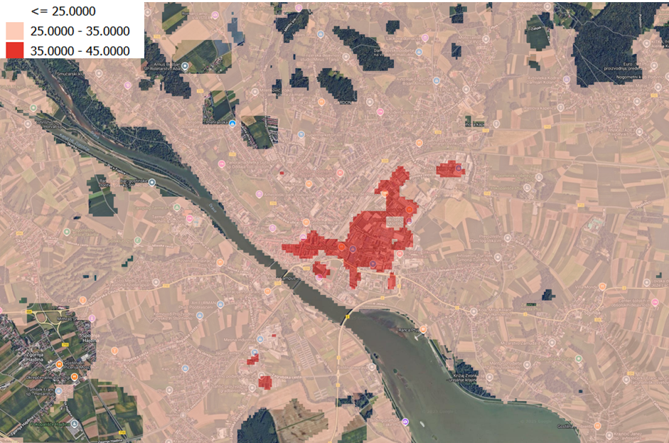

_Figure 19 - an example of LST \[°C] Satellite map from Landsat 8 image for July 2025 loaded and classified in GIS, at the bottom overlay of the map with over 65 population density map from_ [_WorlpopoHUB_](https://hub.worldpop.org/)_._

#### Step 2 – Analysis and mapping

Using the prepared datasets, map near surface air temperature and eventually evaluate anomalies between urban cores and their surrounding rural areas (Figure 18,Figure 19) to map the intensity and extent of UHI zones.

In GIS, you’re able to overlay these UHI maps with demographic layers to locate clusters of vulnerable populations.

The outputs of this stage typically include thematic layers visualizing **spatial patterns of thermal stress** and their **relationship with key physical drivers** such as vegetation cover, building density, land cover type, and **population distribution**. These maps form the basis for identifying priority areas for targeted mitigation measures.

#### Step 3 – Baseline Urban Climate Modelling

Using the datasets prepared in Step 1 and the analytical overlays from Step 2, develop a baseline urban climate model to represent current conditions during extreme heat events. The objective is to simulate microclimatic patterns—such as air temperature distribution, surface temperature, and thermal comfort indices—across the study area without any mitigation interventions applied.

This process typically involves:

* Importing pre-processed land cover, vegetation, and morphology grids into the selected modelling framework.
* Integrating meteorological time series representative of identified heatwave periods.
* Parameterizing urban form (building heights, materials, vegetation characteristics) to reflect present-day conditions.

Where available, satellite-derived LST maps and temperature anomaly layers from Step 2 can be used to cross-check the model outputs, ensuring that simulated baseline conditions (e.g. Figure 18) are consistent with observed spatial patterns of heat stress.

These validated baseline results then serve as a quantitative reference for evaluating the potential effects of Nature-Based Solutions in the following step.

_Figure 20 – example of temperature difference in mean ground temperature \[°C] for an urban area simulated with UMEP._

#### Step 4 – NbS scenario testing

Repeat the baseline modelling from Step 3, incorporating **Nature-Based Solutions** identified in regional adaptation strategies, such as increasing urban tree canopy, creating green corridors, installing green roofs and walls, or applying reflective surface materials. Configure each scenario within the chosen modelling framework to quantify cooling effects under both present-day conditions and **projected future climates** (e.g., using downscaled scenarios from Copernicus CDS).

Outputs should allow direct comparison with the baseline, evaluating changes in maximum temperatures, reduction of UHI hotspot extent, and improvements in thermal comfort indices. If relevant, integrate observed thermal maps from Step 2 to validate simulated changes and ensure scenario realism.

NbS scenario testing was conducted using an evidence-based, conceptual “what-if” approach. In the absence of implemented urban heat mitigation projects in Ptuj, design principles from a comparable green parking area in Slovenska Bistrica were adopted as a reference.

The scenario assumes the replacement of the existing fully asphalted parking area with a green parking solution incorporating permeable surfaces, vegetated strips, and tree planting for shading. Based on empirical evidence and published studies, such interventions are expected to reduce surface temperatures, mitigate local heat hotspots, and improve thermal comfort for users at the micro-scale. The assessment focuses on the expected direction and relative magnitude of impacts rather than on absolute temperature values.

* **Limitations and uncertainties**

The assessment is based on proxy indicators and conceptual scenario assumptions rather than numerical microclimate modelling. Results therefore represent relative changes and indicative effects. Due to the small spatial scale of the intervention, impacts are expected to be local and do not significantly alter city-scale temperature patterns. Actual performance would depend on **detailed design, vegetation characteristics, and maintenance practices.**

* **Key takeaway**

This case study demonstrates that even small-scale, targeted Nature-Based Solutions can meaningfully reduce local heat exposure in highly sealed urban environments. While their individual impact on city-wide temperatures is limited, such interventions are highly effective at the micro-scale and, when systematically implemented, form an essential component of long-term urban heatwave adaptation strategies.

#### Bonus section – Tutorial flood dataset

All input data needed to replicate the Slovenia–Podravje flood workflow are provided in [this dedicated dataset.](https://drive.google.com/file/d/1o-XOpTNsou-EgrWioIEuq_-OwW4gmA62/view?usp=sharing)
